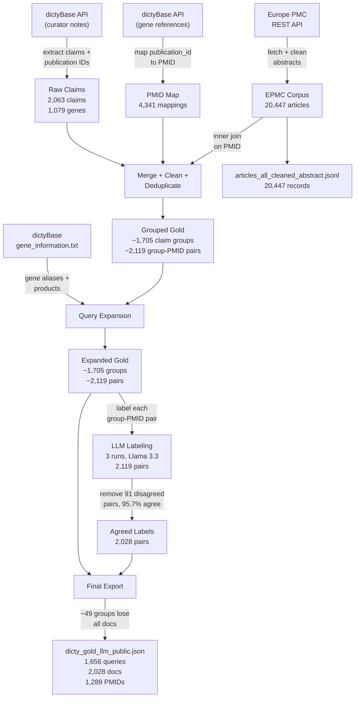

# Gold Standard Dataset Construction

This document describes how `dicty_gold_llm_public.json` was constructed from raw dictyBase resources. **Part A** is a concise methods section suitable for a scientific paper. **Part B** is a detailed technical reference with exact file paths, thresholds, and code-level provenance.

---

# Part A -- Methods (Paper-Ready)

## Overview

We constructed a gold standard retrieval benchmark for *Dictyostelium discoideum* literature by extracting curator-written claim sentences from dictyBase, linking them to PubMed articles via Europe PMC (EPMC), and validating each claim--article pair with a large language model. The pipeline consists of seven stages: (1) curator note extraction, (2) publication identifier mapping, (3) literature corpus assembly, (4) claim cleaning and deduplication, (5) query expansion, (6) LLM-based labeling with agreement filtering, and (7) final export.



## 1. Curator Note Extraction

Structured curator notes were downloaded from the dictyBase gene summary API for all gene identifiers listed in the dictyBase curation status file. Each note was parsed as a JSON token stream; citation markers of the form `[[PUB:id]]` were used to segment the text into individual claim sentences, each associated with one or more dictyBase publication identifiers and author--year citation captions. This yielded 2,063 claim sentences across 1,079 genes.

## 2. Publication Identifier Mapping

DictyBase uses internal publication identifiers that do not correspond directly to PubMed IDs (PMIDs). To bridge this gap, we programmatically retrieved the references tab for each gene via the dictyBase API and built a mapping table of 4,341 unique publication-to-PMID pairs. Of the publication IDs referenced in curator claims, 27 could not be mapped and were excluded from subsequent steps.

## 3. Literature Corpus Assembly (EPMC)

We assembled a comprehensive *Dictyostelium* literature corpus by querying the Europe PMC REST API with the search term `dictyostelium AND (HAS_FT:Y) AND (SRC:MED OR SRC:PMC)`. Articles were retrieved using paginated cursor-based fetching. Abstracts were cleaned by decoding HTML entities, stripping residual JATS/HTML markup, and normalizing whitespace. This produced a corpus of 20,447 articles with non-null abstracts and valid PMIDs.

## 4. Claim Cleaning and Deduplication

Raw claims were cleaned and deduplicated in multiple passes. First, citation captions were normalized (parentheses removed, `et al.` standardized). Claims shorter than six words were discarded. Exact duplicates (identical text, anchors, and citations) were merged by concatenating their gene identifiers. For claims with identical text but inconsistent citation metadata, only the first variant was retained.

Publication IDs were mapped to PMIDs via the mapping from Step 2; claims without a valid PMID were removed. The remaining claims were intersected with the EPMC corpus (Step 3) via an inner join on PMID, discarding claims whose cited article lacked an abstract in the corpus---these were predominantly older publications.

To consolidate near-duplicate claims arising from minor textual variations (punctuation, capitalization), we computed pairwise cosine similarities over TF-IDF character n-gram vectors (n = 3--5) and clustered claims using a union-find algorithm with a similarity threshold of 0.6. For each cluster, the longest claim variant was selected as the representative query. This produced approximately 1,705 claim groups, each associated with one or more cited documents containing the article PMID, title, and cleaned abstract. Because many claims cite multiple publications, these 1,705 groups expand to approximately 2,119 (claim group, PMID) pairs when flattened for labeling.

## 5. Query Expansion

To improve retrieval recall, we augmented each query with structured gene information from the dictyBase gene information file. Gene mentions in queries were detected by matching DDB_G identifiers or gene name/synonym tokens. Ambiguous aliases (mapping to five or more genes, shorter than four characters, or in a generic blocklist) were excluded.

Two expansion variants were produced. The *synonyms-only* variant appends canonical gene names and filtered synonyms. The *long* variant additionally includes gene product descriptions. Expansion was tiered by the number of detected genes: full expansion for one or two genes, light expansion (canonical names only) for three, and no expansion for four or more, to avoid clutter.

## 6. LLM Labeling and Agreement Filtering

Each claim--article pair was labeled by Llama 3.3 using a structured prompt that requested two judgments: (a) `doc_match`---whether the article is a correct document-level match for the claim (`yes`, `no`, or `unclear`); and (b) `evidence_level`---whether the abstract alone supports the claim at the detail level, core level, or requires full text (`abstract_supports_detail`, `abstract_supports_core`, `needs_fulltext`, or `not_applicable`).

The unit of labeling is the (claim group, PMID) pair. The ~1,705 claim groups expand to 2,119 such pairs (since many claims cite multiple publications). To assess consistency, labeling was performed in three independent runs over all 2,119 pairs. Disagreement was defined as `yes` versus `no`/`unclear` for document match, and any abstract-support label versus `needs_fulltext` for evidence level. Pairs with full agreement on both dimensions were retained, yielding 2,028 pairs (95.7% agreement). Representative labels were assigned by priority: `yes` > `no` > `unclear` for document match; `abstract_supports_detail` > `abstract_supports_core` > `needs_fulltext` for evidence level.

## 7. Final Export

The expanded gold set was joined with the agreed LLM labels on (claim group, PMID). Only pairs present in both were retained and re-grouped to the question level. Because 91 pairs were removed by agreement filtering, approximately 49 claim groups lost all of their associated documents, reducing the query count from ~1,705 to 1,656. The resulting dataset follows a BioASQ-inspired JSON schema.

## Summary Statistics

| Stage | Item | Count |
| --- | --- | --- |
| 1. Extraction | Genes with curator notes | 1,079 |
| 1. Extraction | Raw claims | 2,063 |
| 2. PMID mapping | dictyBase publications with PMID | 4,341 |
| 2. PMID mapping | Publications in claims with PMID | 1,372 |
| 3. EPMC corpus | Articles with abstracts | 20,447 |
| 4. Clean + EPMC join | Claims with title/abstract | 2,020 |
| 4. Clean + EPMC join | Unique PMIDs cited | 1,340 |
| 4. Clustering | Claim groups (unique queries) after dedup | ~1,705 |
| 4. Clustering | (group, PMID) pairs after flattening | ~2,119 |
| 6. LLM labeling | Pairs labeled (3 runs) | 2,119 |
| 6. LLM labeling | Pairs with full agreement | 2,028 (95.7%) |
| 6. LLM labeling | Pairs removed (disagreement) | 91 (4.3%) |
| 7. Final export | Queries (groups with >= 1 agreed doc) | 1,656 |
| 7. Final export | Queries lost (all docs disagreed) | ~49 |
| 7. Final export | Labeled query--document pairs | 2,028 |
| 7. Final export | Unique PMIDs | 1,289 |

## Dataset Schema

Each entry in `dicty_gold_llm_public.json` is structured as:

| Field | Description |
| --- | --- |
| `id` | Claim group identifier (string) |
| `body` | Original curator claim text |
| `body_expansion_synonyms` | Query expanded with gene synonyms |
| `body_expansion_long` | Query expanded with gene synonyms and products |
| `documents` | List of PubMed URLs for cited articles |
| `docs[]` | Array of document objects (see below) |

Each element of `docs[]`:

| Field | Description |
| --- | --- |
| `publication_id` | dictyBase internal publication ID |
| `pmid` | PubMed identifier |
| `title` | Article title |
| `abstract_clean` | Cleaned abstract text |
| `year` | Publication year |
| `anchor_pos` | Citation anchor positions in the claim |
| `citation_captions` | Author--year citation strings |
| `doc_match` | LLM label: `yes`, `no`, or `unclear` |
| `evidence_level` | LLM label: `abstract_supports_detail`, `abstract_supports_core`, `needs_fulltext`, or `not_applicable` |
| `reason` | LLM reasoning (brief, may be empty) |

The companion file `articles_all_cleaned_abstract.jsonl` contains the full EPMC corpus (20,447 records) as one JSON object per line with fields `pmid`, `title`, `abstract` (cleaned), and article metadata.

---

# Part B -- Detailed Technical Reference

## Pipeline Overview (with file provenance)

All numbered pipeline artifacts are written under **`output/dicty_gold_build/`** (gold-standard build bundle). Filenames use step order prefixes (`1_…`, `2_…`, …). Other trees (for example `scripts/public/article_fetching/output/`) are separate.

```mermaid
flowchart TD
    subgraph step1 ["Step 1: Curator Note Extraction"]
        S1_in1["dictybase_files/DDB_G-curation_status.txt"]
        S1_api["dictyBase API /gene/GENE_ID/gene/summary.json"]
        S1_script["scripts/public/data_prep/dicty_curator_notes.py"]
        S1_nb["notebooks/01_curator_notes_download.ipynb"]
        S1_out2["output/dicty_gold_build/1_curator_claims.parquet"]
        S1_in1 --> S1_script
        S1_api --> S1_script
        S1_script --> S1_out2
    end

    subgraph step2 ["Step 2: Publication ID to PMID"]
        S2_api["dictyBase API /gene/GENE_ID/references.json"]
        S2_script["scripts/public/data_prep/dicty_publication.py"]
        S2_nb["notebooks/02_gene_publication_mapping.ipynb"]
        S2_out["output/dicty_gold_build/2_publication_id_pmid.csv"]
        S2_api --> S2_script
        S2_script --> S2_out
    end

    subgraph step3 ["Step 3: EPMC Corpus"]
        S3_api["Europe PMC REST API"]
        S3_fetch["scripts/public/article_fetching/fetch.py"]
        S3_jsons["article_fetching/output/all_cleaned/*.json"]
        S3_nb["notebooks/03_epmc_fetch_exploration.ipynb"]
        S3_out["output/dicty_gold_build/3_articles_cleaned_abstract.parquet"]
        S3_api --> S3_fetch
        S3_fetch --> S3_jsons
        S3_jsons --> S3_nb
        S3_nb --> S3_out
    end

    subgraph step4 ["Step 4: Merge + Clean + Deduplicate"]
        S4_nb["notebooks/04_datasets_merge_clean.ipynb"]
        S4_int4["output/dicty_gold_build/4a_claim_groups.parquet"]
        S4_out["output/dicty_gold_build/4b_golden_grouped.parquet"]
    end

    subgraph step5 ["Step 5: Query Expansion"]
        S5_gene["dictybase_files/gene_information.txt"]
        S5_nb["notebooks/05_query_expansion_bm25.ipynb"]
        S5_out1["output/dicty_gold_build/5a_gold_query_expand.parquet"]
        S5_out2["output/dicty_gold_build/5b_gold_query_expand_flat.tsv"]
    end

    subgraph step6 ["Step 6: LLM Labeling"]
        S6_script["scripts/public/data_prep/dicty_claim_labeler.py"]
        S6_nb["notebooks/06_goldset_llm_labeling.ipynb"]
        S6_runs["output/dicty_gold_build/6a-c_llm_labels_run{1,2,3}.jsonl"]
        S6_out["output/dicty_gold_build/6d_llm_full_agreement.tsv"]
    end

    subgraph step7 ["Step 7: Final Export"]
        S7_nb["notebooks/07_final_public_export.ipynb"]
        S7_pub["output/dicty_gold_build/7a_dicty_gold_llm_public.json"]
        S7_priv["output/dicty_gold_build/7b_dicty_gold_llm_private.json"]
        S7_jsonl["output/dicty_gold_build/7c_articles_cleaned_abstract.jsonl"]
    end

    S1_out2 --> S4_nb
    S2_out --> S4_nb
    S3_out --> S4_nb
    S4_out --> S5_nb
    S5_gene --> S5_nb
    S5_out2 --> S6_script
    S5_out1 --> S7_nb
    S6_out --> S7_nb
    S3_out --> S7_nb
    S7_nb --> S7_pub
    S7_nb --> S7_priv
    S7_nb --> S7_jsonl
```



## Complete Intermediate File Provenance

| File | Produced by | Key columns / fields | Approx. rows |
| --- | --- | --- | --- |
| `output/dicty_gold_build/1_curator_claims.parquet` | `dicty_curator_notes.py` | gene_id, claim_plain, anchors, publication_ids, citation_captions, citation_years, sentence_markers, sentence_plain, cited_sentence_marked | 2,063 |
| `output/dicty_gold_build/2_publication_id_pmid.csv` | `dicty_publication.py` | publication_id, pmid (Int64) | 4,341 |
| `scripts/public/article_fetching/output/all_cleaned/*.json` | `fetch.py` | pmid, pmcid, doi, year, title, journal, authors, abstract, text | ~20,447 files |
| `output/dicty_gold_build/3_articles_cleaned_abstract.parquet` | `03_epmc_fetch_exploration.ipynb` | pmid, pmcid, doi, year, title, journal, authors, abstract_clean, file | 20,447 |
| `output/dicty_gold_build/4a_claim_groups.parquet` | `04_datasets_merge_clean.ipynb` | claim_id, group_claim_id, claim_plain, claim_sim, gene_id, rep_claim_id, canonical_query, is_representative_claim | ~2,000 rows (one per deduplicated claim_id) |
| `output/dicty_gold_build/4b_golden_grouped.parquet` | `04_datasets_merge_clean.ipynb` | group_claim_id, rep_claim_id, query, n_variants, n_citations, query_n_words, years, docs (struct list) | ~1,705 |
| `output/dicty_gold_build/5a_gold_query_expand.parquet` | `05_query_expansion_bm25.ipynb` | group_claim_id, query, query_expand_synonyms, query_expand_long, query_expand, docs | ~1,705 |
| `output/dicty_gold_build/5b_gold_query_expand_flat.tsv` | `05_query_expansion_bm25.ipynb` | group_claim_id, query, query_expand_synonyms, query_expand_long, query_expand, pmid, title, abstract_clean, year | ~2,100 |
| `output/dicty_gold_build/6a_llm_labels_run1.jsonl` | `dicty_claim_labeler.py` (run 1) | group_claim_id, pmid, doc_match, evidence_level, reason | ~2,100 |
| `output/dicty_gold_build/6b_llm_labels_run2.jsonl` | `dicty_claim_labeler.py` (run 2) | (same) | ~2,100 |
| `output/dicty_gold_build/6c_llm_labels_run3.jsonl` | `dicty_claim_labeler.py` (run 3) | (same) | ~2,100 |
| `output/dicty_gold_build/6d_llm_full_agreement.tsv` | `06_goldset_llm_labeling.ipynb` | group_claim_id, pmid, doc_match, evidence_level | 2,028 |
| `output/dicty_gold_build/7b_dicty_gold_llm_private.json` | `07_final_public_export.ipynb` | (full payload including internal fields) | 1,656 questions |
| `output/dicty_gold_build/7a_dicty_gold_llm_public.json` | `07_final_public_export.ipynb` | id, body, body_expansion_synonyms, body_expansion_long, documents, docs | 1,656 questions, 2,028 docs |
| `output/dicty_gold_build/7c_articles_cleaned_abstract.jsonl` | `07_final_public_export.ipynb` | pmid, title, abstract (= abstract_clean), + metadata | 20,447 |

## Step 1: Curator Note Extraction (detailed)

### Source data

- **Gene universe**: all gene IDs from `dictybase_files/DDB_G-curation_status.txt` (tab-separated, column 0 = DDB_G identifier). The file `dictybase_files/gene_information.txt` contains the same gene set and is used later for query expansion but not for the initial crawl.
- **API endpoint**: `http://dictybase.org/gene/{gene_id}/gene/summary.json` returns a JSON structure where curator notes are nested at `data[0].items[0].content[0].items[1].content[0].items` as a token list.

### Parsing logic

Each token is either a `{"text": "..."}` fragment or a `{"caption": "...", "url": "/publication/####"}` citation link. The parser (`extract_publication_claims_from_tokens` in `01_curator_notes_download.ipynb`):

1. Concatenates tokens into an HTML-with-markers string, replacing citation links with `[[PUB:####]]` markers.
2. Converts `<br>` tags to sentence boundaries (`. `), then strips remaining HTML via BeautifulSoup.
3. Splits on sentence-ending punctuation (`(?<=[.!?])\s+`).
4. Merges citation-only fragments (sentences containing only markers and punctuation) back into their preceding sentence.
5. For each sentence containing at least one `[[PUB:####]]` marker:
   - Extracts `publication_ids` (ordered, deduplicated).
   - Builds `claim_plain` by removing citation parentheticals and bare markers.
   - Records `anchors`: character-offset positions in the cleaned claim where each citation appeared, as `[{"pos": int, "pub_ids": [int, ...]}]`.
   - Extracts `citation_captions` (author-year strings) and `citation_years` from the original caption text using regex `\b(18\d{2}|19\d{2}|20\d{2})\b`.

### Production run

```
docker run -it -v "$PWD/output:/dictycite/output" --platform=linux/amd64 \
  fulaibaowang/dictycite:16.01.2026 \
  python /dictycite/scripts/public/data_prep/dicty_curator_notes.py --limit 0 \
  --sleep-base 0.25 --sleep-jitter 0.10
```

Runtime: ~2 hours. Outputs: `output/dicty_gold_build/1_curator_notes.parquet` (all gene notes), `output/dicty_gold_build/1_curator_claims.parquet` (extracted claims), `output/dicty_gold_build/1_publications.parquet` (publication metadata deduped by publication_id).

### Counts

- Genes queried: ~13,000 (from curation status file)
- Genes with non-empty curator notes: 1,079
- Claims extracted: 2,063
- Unique publication IDs in claims: ~1,400

## Step 2: Publication ID to PMID Mapping (detailed)

### Source

DictyBase internal publication IDs (integers, e.g. `19729`) do not correspond to PubMed IDs. The mapping is obtained by querying `http://dictybase.org/gene/{gene_id}/references.json` for each gene and parsing the returned publication records which include both the dictyBase ID and, when available, the PMID.

### Implementation

- **Production script**: `scripts/public/data_prep/dicty_publication.py`
- **Exploration notebook**: `notebooks/02_gene_publication_mapping.ipynb`
- Two runs were concatenated (`2_gene_publication_pmid.parquet` + a rerun shard for failed rows) to handle transient server failures.
- Filtered to non-null publication_id, deduplicated.

### Output

`output/dicty_gold_build/2_publication_id_pmid.csv` with columns:
- `publication_id` (Int64): dictyBase internal ID
- `pmid` (Int64): PubMed ID

### Counts

- Unique publication-to-PMID mappings: 4,341
- Publication IDs from curator claims that have a PMID: 1,372
- Publication IDs from curator claims without a PMID mapping: 27

## Step 3: EPMC Literature Corpus (detailed)

### Fetching

- **API**: Europe PMC REST (`https://www.ebi.ac.uk/europepmc/webservices/rest/search`)
- **Query**: `dictyostelium AND (HAS_FT:Y) AND (SRC:MED OR SRC:PMC)`
- **Parameters**: `resultType=core`, `format=json`, `synonym=N`, `pageSize=1000`, cursor-based pagination
- **Production tool**: `scripts/public/article_fetching/fetch.py` stores per-article JSON files in `scripts/public/article_fetching/output/all_cleaned/`

### Abstract cleaning

Implemented in `notebooks/03_epmc_fetch_exploration.ipynb`. For each article JSON:

1. Skip if abstract is null or empty after stripping.
2. If abstract is a list, join elements with `\n`.
3. Apply `html.unescape()` to decode HTML entities (`&amp;`, `&lt;`, etc.).
4. Insert `\n` after closing heading tags (`</h1>` through `</h6>`), `</p>`, and `<br>` variants.
5. Strip heading open tags (`<h1 ...>` through `<h6 ...>`).
6. Strip all remaining HTML/JATS tags (`</?[^>]+>`).
7. Normalize: `\r\n` to `\n`, collapse runs of spaces/tabs to single space, collapse 3+ newlines to double newline, strip leading/trailing whitespace.
8. Store as column `abstract_clean`.

### Output

`output/dicty_gold_build/3_articles_cleaned_abstract.parquet` with columns: `pmid`, `pmcid`, `doi`, `year`, `title`, `journal`, `authors`, `abstract_clean`, `file`.

### PMID overlap with dictyBase

PMID normalization (`normalize_pmid_expr`): cast to string, strip whitespace, remove trailing `.0` (Excel artifact), extract digits only.

- EPMC unique PMIDs: 20,447
- dictyBase unique PMIDs (from Step 2): 4,341
- Overlap: ~4,306 (only ~35 dictyBase PMIDs missing from EPMC)

### Counts

- Articles with non-null abstract and PMID: 20,447
- Articles also having full text: ~12,000 (for reference; not used in gold set)

## Step 4: Merge, Clean, and Deduplicate (detailed)

All operations in `notebooks/04_datasets_merge_clean.ipynb` using Polars.

### 4a. Load and select columns

```python
claims = pl.read_parquet("../output/dicty_gold_build/1_curator_claims.parquet")
df = claims.select(["claim_plain", "anchors", "publication_ids", "citation_captions", "gene_id"])
```

### 4b. Citation caption cleanup

Two passes of `list.eval()` on `citation_captions`:
- Remove parentheses: `str.replace_all(r"[()]", "")`
- Normalize `et al.` variants: `str.replace_all(r"\bet al\b\.?", "et al.")`, fix comma placement around `et al.`
- Collapse whitespace, strip.

### 4c. Short claim filter

- Count words: `claim_plain.str.count_matches(r"\S+")`
- Threshold: `min_words = 6`
- Rows dropped: those with fewer than 6 tokens

### 4d. Exact duplicate merge

```python
merged = df_filtered.group_by(["claim_plain", "anchors", "publication_ids", "citation_captions"])
    .agg(pl.col("gene_id").unique().sort().str.join(","))
```

### 4e. Inconsistent duplicate removal

For claim_plain values that still appear in multiple rows (same text, different citation metadata):
- Sort by `(claim_plain, row_nr)`
- Keep only the first row of each duplicated claim_plain group
- Remove the rest via anti-join on `row_nr`

### 4f. Claim ID assignment

`claim_id = pl.col("claim_plain").rank(method="dense").cast(pl.Int64)`

### 4g. Manual citation alignment patches

Four claims where `len(publication_ids) > len(citation_captions)` (same author, same year, two separate publications):

| claim_id | Patched citation_captions |
| --- | --- |
| 1534 | `["Brandon et al. 1997a", "Brandon et al. 1997b"]` |
| 471 | `["Rupper et al. 2001a", "Rupper et al. 2001b"]` |
| 1469 | `["Pakes et al. 2012a", "Pakes et al. 2012b"]` |
| 1195 | `["Razeto et al. 2007a", "Razeto et al. 2007b"]` |

### 4h. Explode to long format

- Explode `[publication_ids, citation_captions]` simultaneously (one row per publication).
- Build anchor map: explode `anchors` struct list → `(claim_id, publication_id, anchor_pos)`, group anchor_pos as sorted list.
- Left join anchor_map onto long table, then explode `anchor_pos`.
- Result: one row per `(claim_id, publication_id, anchor_pos)`.

### 4i. Year extraction

`year = citation_captions.str.extract(r"(18|19|20)\d{2}", 0).cast(pl.Int32)`

### 4j. Near-duplicate normalization

Claim text normalization to `claim_key`:
```python
claim_key = claim_plain
    .str.to_lowercase()
    .str.replace_all(r"\.{2,}", ".")
    .str.replace_all(r"[^a-z0-9\s]", " ")
    .str.replace_all(r"\s+", " ")
    .str.strip_chars()
```

- `claim_id_new = claim_key.rank(method="dense").cast(pl.Int64)`
- Group by `(claim_id_new, publication_id, citation_captions, anchor_pos, year)`, aggregate: first `claim_plain`, first `anchors`, unique sorted `gene_id` joined by comma.
- Output: `claim_cleaned` sorted by `(claim_id, publication_id, anchor_pos)`.
- Saved (dropped intermediates): `claim_cleaned_long.parquet`, `claim_cleaned_long.tsv`.

### 4k. PMID join

```python
pub_pmid = pl.read_csv("../output/dicty_gold_build/2_publication_id_pmid.csv")
claim_cleaned_pmid = claim_cleaned.join(pub_pmid, on="publication_id", how="left")
claim_cleaned_pmid_nonNA = claim_cleaned_pmid.filter(pmid.is_not_null() & (pmid != "NA"))
```

- Saved (dropped intermediates): `claim_cleaned_long_pmids.parquet`, `claim_cleaned_long_pmids_nonNA.parquet`

### 4l. EPMC abstract intersection

```python
EPMC = pl.read_parquet("../output/dicty_gold_build/3_articles_cleaned_abstract.parquet")
epmc_small = EPMC.select(["pmid", "title", "abstract_clean"])  # cast pmid to Utf8
claim_cleaned_pmid_nonNA_abstract = claim_small.join(epmc_small, on="pmid", how="inner")
```

This **inner join** drops claims whose PMID is not present in the EPMC corpus. Inspection showed these were predominantly old papers without digitized abstracts.

- Saved (dropped intermediate): `claim_cleaned_long_pmids_nonNA_abstract.parquet`

### 4m. Claim similarity normalization (`claim_sim`)

Before clustering, claim text is further cleaned for similarity comparison:
```python
claim_sim = claim_plain
    .str.replace_all(r"[()\[\]{}]", "")    # remove brackets
    .str.replace_all(r";", ",")
    .str.replace_all(r"\.{2,}", ".")
    .str.replace_all(r",(\s*,)+", ",")
    .str.replace_all(r",\s*\.", ".")
    .str.replace_all(r"\.\s*,", ".")
    .str.replace_all(r"\s+([,.])", r"$1")
    .str.replace_all(r",([A-Za-z0-9])", r", $1")
    .str.replace_all(r"\.([A-Za-z])", r". $1")
    .str.replace_all(r"\s+", " ")
    .str.strip_chars()
```

### 4n. TF-IDF near-duplicate clustering

- **Vectorizer**: `TfidfVectorizer(analyzer="char_wb", ngram_range=(3, 5), min_df=1)` from scikit-learn
- **Nearest neighbors**: `NearestNeighbors(n_neighbors=30, metric="cosine")` — computes k=30 nearest neighbors for each claim
- **Pair generation**: for each (i, j) neighbor pair where j > i, compute `sim = 1.0 - cosine_distance`
- **Union-find clustering**: threshold `sim_th = 0.6` (determined by manual inspection of ~2,000 pairs)
  ```python
  for i, j, sim in pairs:
      if sim >= sim_th:
          union(i, j)
  ```
  Path compression with halving in `find()`.
- **Group assignment**: each connected component gets a sequential `group_claim_id` (1..K).
- **Verification**: a second TF-IDF pass on group-canonical texts confirmed no remaining high-similarity inter-group pairs above the threshold.
- Saved: `output/dicty_gold_build/4a_claim_groups.parquet` (per-claim text, genes, group id, canonical query, representative flag)
- Result: ~1,705 claim groups

### 4o. Gold table construction

- **Representative query**: per `group_claim_id`, select the claim variant with the longest `claim_sim` text (most complete wording).
- **Documents struct**: for each group, the representative claim's citations are aggregated:
  ```python
  docs = pl.struct(["publication_id", "pmid", "title", "abstract_clean", "year",
                     "anchor_pos", "citation_captions"])
  ```
  where `anchor_pos` and `citation_captions` are lists (unique, sorted) per (group, publication).
- **Output columns**: `group_claim_id`, `rep_claim_id`, `query`, `n_variants`, `n_citations`, `query_n_words`, `years`, `docs`.
- Saved: `output/dicty_gold_build/4b_golden_grouped.parquet`.
- Also saved (dropped): `tmp/golden_flat.tsv` (exploded, one row per document).

## Step 5: Query Expansion (detailed)

Implemented in `notebooks/05_query_expansion_bm25.ipynb`.

### Gene information source

`dictybase_files/gene_information.txt`: tab-separated with columns `GENE ID`, `Gene Name`, `Synonyms` (comma-separated), `Gene products`. Loaded via Polars and renamed to `gene_id`, `gene_name`, `synonyms`, `gene_products`.

### Alias filtering

**Blocklist** (`GENERIC_ALIAS_BLOCKLIST`):
```
trna, rrna, rna, dna, mrna, atp, gtp, gdp, nad, nadh, nadp, nadph, fadh, coa,
gef, gap, kinase, phosphatase, receptor, transporter, aldh, pks, sod, plb, rnr, pp2c,
putative, mitochondrial, hypothetical protein
```

**Additional filters** (applied identically for detection and expansion):
- Minimum alias length: 4 characters
- `AUTO_BLOCK_MIN_GENE_FREQ = 5`: aliases appearing in 5 or more genes are blocked
- DDB_G-prefixed aliases are never used for detection or expansion text
- Ambiguous aliases (same alias maps to multiple gene IDs): removed from detection lookup

**Per-gene cap**: `MAX_ALIASES_PER_GENE = 3` (canonical name + up to 2 synonyms).

### Detection

Genes are detected in a query by:
1. Regex `\bDDB_G\d+\b` (case-insensitive) matches gene IDs directly.
2. Token matching against `alias_to_gene` dictionary (case-insensitive).
   - Tokens extracted via regex `[A-Za-z0-9][A-Za-z0-9_-]*`.

### Expansion variants

Both are produced by `expand_query_structured()`:

**`query_expand_synonyms`** (`strict=True`, `include_gene_products=False`):
- 1--2 genes: full expansion (canonical name + filtered synonyms, max 3 per gene)
- 3 genes: light (canonical names only, no synonyms)
- 4+ genes: no expansion (query returned as-is)

**`query_expand_long`** (`strict=False`, `include_gene_products=True`):
- 1--2 genes: full expansion (canonical name + synonyms + gene products)
- 3 genes: light (canonical name + gene products, no synonyms)
- 4+ genes: one minimal block (first gene's canonical name + product)

Format: expansion is appended after `\n`, with gene blocks separated by ` ||| `:
```
original claim text
geneMention1: alias1, alias2, gene product ||| geneMention2: alias3
```

Backward compatibility alias: `query_expand = query_expand_long`.

### Outputs

- `output/dicty_gold_build/5a_gold_query_expand.parquet`: adds `query_expand_synonyms`, `query_expand_long`, `query_expand` columns to `golden_grouped.parquet`.
- `output/dicty_gold_build/5b_gold_query_expand_flat.tsv`: exploded (one row per document), with columns `group_claim_id`, `query`, `query_expand_synonyms`, `query_expand_long`, `query_expand`, `pmid`, `title`, `abstract_clean`, `year`.

## Step 6: LLM Labeling and Agreement (detailed)

### Model and API

- Model: **Llama 3.3** (`llama3.3:latest`)
- Endpoint: `https://chat.fri.uni-lj.si/ollama/api/generate` (institutional Ollama instance)
- Authentication: Bearer token via `LLAMA_API_KEY` environment variable
- Parameters: `stream=False`, default temperature

### Prompt template

The labeler uses the expanded query (`query_expand` / long variant, falling back to `query` if empty) as the claim text. The prompt instructs the model to:

1. Identify the main entities, core claim, and detail claims.
2. Scan title + abstract for explicit support.
3. Assign `doc_match`: `yes` (on-topic, supports core), `no` (unrelated), `unclear` (ambiguous).
4. Assign `evidence_level`: `abstract_supports_detail` (core + detail), `abstract_supports_core` (core only), `needs_fulltext` (plausibly on-topic but abstract insufficient), `not_applicable` (if doc_match = no).

Output format: JSON with keys `doc_match`, `evidence_level`, `reason` (max 25 words).

### Production runs

```bash
python scripts/public/data_prep/dicty_claim_labeler.py \
  --input_tsv output/dicty_gold_build/5b_gold_query_expand_flat.tsv \
  --output_jsonl output/dicty_gold_build/6a-c_llm_labels_runN.jsonl \
  --sleep_s 0.5 --raise_on_error TRUE
```

Three independent runs: `run1.jsonl`, `run2.jsonl`, `run3.jsonl`. The input `gold_with_query_expand_flat.tsv` contains ~2,119 rows---one per (group_claim_id, pmid) pair, since the ~1,705 claim groups expand to more pairs when groups cite multiple publications.

### Agreement computation

Implemented in `notebooks/06_goldset_llm_labeling.ipynb`.

1. Merge three runs on `(group_claim_id, pmid)` via outer join. Total overlap: 2,119 pairs (matches the flat TSV row count).
2. **Doc-match disagreement** (`doc_match_disagree`): pairwise check across all three runs.
   - Disagreement: `yes` paired with `no` or `unclear` in any run pair.
   - NOT disagreement: `no` vs `unclear` (both indicate non-match).
3. **Evidence-level disagreement** (`evidence_disagree`): pairwise check.
   - Disagreement: any of `{abstract_supports_detail, abstract_supports_core}` paired with `needs_fulltext`.
   - NOT disagreement: `abstract_supports_detail` vs `abstract_supports_core` (both indicate abstract support).
4. **Full agreement mask**: `~doc_match_disagree & ~evidence_disagree`.

### Agreement results

| Metric | Count | Rate |
| --- | --- | --- |
| Total pairs (3-run overlap) | 2,119 | -- |
| Doc-match disagreements | ~40 | ~1.9% |
| Evidence-level disagreements | ~55 | ~2.6% |
| Any disagreement | 91 | 4.3% |
| **Full agreement** | **2,028** | **95.7%** |

### Representative label selection (for full-agreement subset)

**doc_match**: if any run says `yes` → `yes`; else if any says `no` → `no`; else `unclear`.

**evidence_level**: if any run says `abstract_supports_detail` → `abstract_supports_detail`; else if any says `abstract_supports_core` → `abstract_supports_core`; else `needs_fulltext`.

### Label distribution (full agreement, 2,028 pairs)

| doc_match | Pairs | Queries |
| --- | --- | --- |
| yes | 1,930 | 1,599 |
| no | 154 | 145 |
| unclear | 8 | 8 |

| evidence_level | Pairs | Queries |
| --- | --- | --- |
| abstract_supports_core | 762 | 654 |
| abstract_supports_detail | 631 | 619 |
| needs_fulltext | 262 | 251 |
| not_applicable | 158 | 150 |

### Outputs

- `output/dicty_gold_build/6d_llm_full_agreement.tsv`: 2,028 pairs with representative `doc_match` and `evidence_level`.

## Step 7: Final Public Export (detailed)

Implemented in `notebooks/07_final_public_export.ipynb`.

### Inputs

| File | Role |
| --- | --- |
| `output/dicty_gold_build/5a_gold_query_expand.parquet` | Gold set with query expansion columns and docs struct |
| `output/dicty_gold_build/6d_llm_full_agreement.tsv` | Agreed LLM labels (group_claim_id, pmid, doc_match, evidence_level) |
| `output/dicty_gold_build/3_articles_cleaned_abstract.parquet` | EPMC corpus (for JSONL export) |

### Join logic

The gold parquet contains ~1,705 groups, each with a `docs` struct list. Exploding yields ~2,119 (group_claim_id, pmid) rows. The inner join with the 2,028 agreed labels drops the 91 disagreed pairs. After re-grouping, groups that lost *all* their documents (~49 groups) disappear, leaving 1,656 queries.

```python
# Explode gold docs to one row per (group_claim_id, pmid) → ~2,119 rows
gold_long = gold.select([...]).explode("docs").unnest_struct_fields(...)

# Inner join with labels → 2,028 rows (91 disagreed pairs dropped)
labeled = gold_long.join(labels, on=["group_claim_id", "pmid"], how="inner")

# Re-group to question level → 1,656 groups (those with >= 1 agreed doc)
grouped = labeled.group_by("group_claim_id").agg([
    pl.first("query"), pl.first("query_expand_synonyms"), pl.first("query_expand_long"),
    pl.struct([...doc fields + label fields...]).alias("docs"),
])
```

### Output construction

For each question:
- `id` = `str(group_claim_id)`
- `body` = `query.strip()`
- `body_expansion_synonyms` = `query_expand_synonyms.strip()`
- `body_expansion_long` = `query_expand_long.strip()`
- `documents` = `["http://www.ncbi.nlm.nih.gov/pubmed/{pmid}" for pmid in pmids]`
- `docs` = list of document objects (as in schema above)

### Private vs. public

- **Private** (`dicty_gold_llm_private.json`): all fields including internal metadata.
- **Public** (`dicty_gold_llm_public.json`): only `id`, `body`, `body_expansion_synonyms`, `body_expansion_long`, `documents`, `docs`.

### EPMC JSONL export

```python
docs = pl.read_parquet(DOCS_PATH).rename({"abstract_clean": "abstract"})
docs.write_ndjson(DOCS_JSONL_OUT)
```

One JSON object per line. Key `abstract` holds the cleaned abstract text.

### Final counts

| Metric | Value | Note |
| --- | --- | --- |
| Claim groups in gold parquet | ~1,705 | from Step 4 |
| (group, PMID) pairs exploded | ~2,119 | multi-doc groups expand |
| Agreed pairs (from Step 6) | 2,028 | 91 dropped by disagreement |
| Groups that lost all docs | ~49 | all their pairs disagreed |
| **Questions (queries)** | **1,656** | groups with >= 1 agreed doc |
| **Labeled query--document pairs** | **2,028** | |
| **Unique PMIDs in gold** | **1,289** | |
| EPMC corpus records | 20,447 | |

---

## Gold-linked notes build dataset (Step 8)

After the public gold JSON exists, we optionally build a **gene-level provenance dataset** for generation / grounding work. It is **not** the retrieval gold set; it reconnects each **gold-linked** `gene_id` (from `4a_claim_groups.parquet` restricted to `group_claim_id` present in `7a_dicty_gold_llm_public.json`) to the **full** dictyBase curator note from `GET /gene/{gene_id}/gene/summary.json`.

**Script:** `scripts/public/data_prep/build_gold_linked_notes_dataset.py`

**Outputs** (under `output/dicty_gold_build/`):

| File | Role |
| --- | --- |
| `8_raw_notes_snapshot.jsonl` | One JSON object per gene: `gene_id`, fetch metadata, and `summary_json_raw` (full API payload). |
| `8a_gold_linked_notes_build.jsonl` | One JSON object per gene: gene metadata (from `gene_information.txt`), `summary_json_raw`, canonical **`curator_notes_blocks`**, derived **`curator_notes_marked_text`** / **`curator_notes_plain_text`**, **`citation_anchors`**, `gold_linkage` (groups, bodies, publication_ids, pmids), and `coverage` stats. |
| `8c_build_provenance_stats.tsv` | Per-gene summary metrics (rebuilt from the full `8a` file after each run). |
| `8d_build_provenance_report.md` | Short human-readable run summary. |

**Canonical blocks:** Curator notes are mixed HTML + text + publication and gene links. Tokens from the API are converted to an ordered list of blocks (`text` with raw HTML fragment, `citation` with `publication_id` / caption / url, `gene_link`, `break` for `<br>`). **Plain and marked strings are derived** by concatenating block renderings in order. Citation blocks carry dictyBase **`publication_id`** (internal reference id) for joins to PMID via `2_publication_id_pmid.csv`.

**Anchors:** `citation_anchors` entries reference `stream` (`marked` or `plain`), `start` / `end` (Python string indices into the corresponding derived string), and `publication_id`.

**CLI notes:** Default run truncates `8_*` outputs first. Use `--resume --resume-build --no-overwrite` to continue after an interrupted run (reuse `8_raw` snapshots, append missing genes to `8a`).
